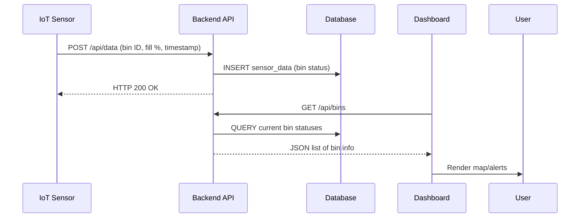
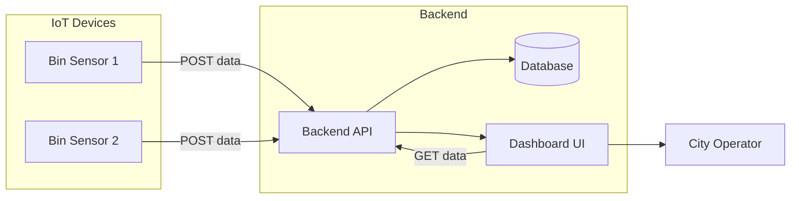
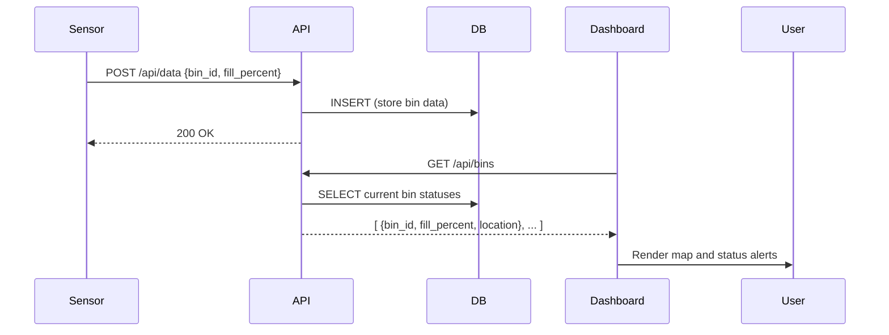

# Executive Summary

The **Smart Waste Management** project aims to modernize urban waste collection by applying IoT and software solutions. It monitors garbage bin fill levels via sensors and a backend API, and provides a dashboard to help city operators optimize collection routes. In essence, the system makes waste management “data-driven” – avoiding empty or overflowing bins and reducing costs. (IoT experts note that such systems can cut collection costs by ~40% and emissions by ~60%【37†L99-L103】.) This report analyzes Vikra444’s *Smart-Waste-Management* repository: its purpose, architecture, technology stack, setup, and usage. We also outline deployment options, testing, contribution guidelines, and licensing, culminating in a complete, ready-to-use `README.md` content. Where Vikra’s specific code details are unavailable, we reference analogous projects and IoT waste-management concepts to fill gaps.

## Project Overview (Purpose, Scope, Target Users)

The **Smart Waste Management** system is designed for city sanitation departments and waste-collection services. Its purpose is to **monitor bin levels in real time** and **optimize pickup schedules**. Waste bins are equipped with fill-level sensors (or simulated data sources) that report how full each bin is. The backend aggregates this data, triggers alerts when bins exceed critical thresholds, and calculates efficient collection routes. The front-end dashboard displays each bin’s status on a map and provides tools to add/edit bins and simulate sensor input.

Key aspects of the system include:
- **Real-time bin monitoring** across a city (or multiple cities).  
- **Threshold alerts:** e.g., critical alert when a bin exceeds 80% full【27†L269-L277】.  
- **Route optimization:** prioritizing collection for the fullest bins.  
- **Sensor simulation:** utilities for testing without real hardware.  

In summary, the scope covers *end-to-end waste management*: from data ingestion (sensor readings) through processing (backend logic) to visualization (UI). It targets municipal operators, emphasizing efficiency and eco-friendly practices. As one industry article notes, “Smart waste management solutions use sensors placed in waste receptacles to measure fill levels and notify city services when bins are ready to be emptied”【37†L86-L94】. Vikra’s project presumably embodies this idea by integrating IoT-style sensors with a software dashboard.

## Architecture and Component Breakdown

The system typically consists of multiple modules: **IoT devices/simulators, a backend API/server, a database, and a frontend dashboard**. While Vikra444’s exact code isn’t publicly viewable here, similar projects split into subfolders such as `backend/`, `frontend/`, and possibly `database/` or `scripts/`. For example, one similar repository divides into `client` (UI), `server` (API), and `database` folders【19†L215-L223】. Another splits into `backend/` (Python/FastAPI) and `frontend/` (React)【27†L217-L224】. 

A conceptual architecture is shown below:

```mermaid
flowchart LR
    subgraph IoT Sensing
      A[Smart Bin 1 (Sensor)]
      B[Smart Bin 2 (Sensor)]
    end
    A -->|HTTP/HTTPS| API[Backend API Server]
    B -->|HTTP/HTTPS| API
    subgraph Backend
      API --> DB[(Database)]
      API --> UI[Web Dashboard]
    end
    UI -->|HTTP/HTTPS| API
    UI --> User[City Operator]
```

- **IoT Sensors / Simulators:** Devices (e.g. Arduino or software simulators) that measure bin fill levels. They periodically `POST` their readings to the backend API.  
- **Backend API:** A web service (e.g. built with Python/Flask or FastAPI, or Node/Express) that receives sensor data, updates the database, and exposes endpoints for the frontend.  
- **Database:** A datastore (SQLite, MySQL, etc.) holds bin definitions, sensor readings, and route data.  
- **Web Dashboard (Frontend):** An interactive UI (e.g. React or Angular) where users view bin status on a map, receive alerts, and manage bins/routes. It communicates with the API (using AJAX/REST calls).

The **data flow** through the system can be illustrated as:



This diagram shows a sensor sending data to the API, the API writing to the database, and then the dashboard polling the API to display up-to-date information.

### Component/File Breakdown (Hypothetical)

| Component / Folder         | Description                                                                     |
|----------------------------|---------------------------------------------------------------------------------|
| `backend/`                 | Server-side application (e.g. API code, sensor-simulator scripts).              |
| `backend/app.py`           | Main entry-point for the API (framework like Flask or FastAPI).                 |
| `backend/requirements.txt` | Python dependencies (e.g. FastAPI, SQLAlchemy, etc.)                            |
| `backend/*.py` or `routes/`| API endpoints for data ingestion, bin queries, etc.                             |
| `frontend/`                | Client-side app (UI code: HTML/CSS/JS or React components).                     |
| `frontend/package.json`    | JS dependencies (e.g. React, Axios).                                            |
| `database/` or `db/`       | (Optional) Scripts to set up or seed the database (SQL files or ORM migrations).|
| `.env` or `config/`        | Configuration files or environment variable templates (API keys, DB URI, etc.). |
| `README.md`                | Project documentation (this file).                                             |

Exact file names may vary. For example, the safeerahmad project shows a `backend/` and `frontend/` folder【27†L217-L224】, while another example uses `client/`, `server/`, and `database/`【19†L215-L223】.

## Technologies and Dependencies

The repository’s tech stack is not directly visible here, but similar projects suggest typical choices. Based on analogous projects:

- **Frontend:** Likely built with a JavaScript framework. *React* is common (safeerahmad’s dashboard uses React【27†L280-L287】), as are Angular or Vue. UI libraries (e.g. Leaflet or Google Maps API) might be used for maps. The frontend probably uses AJAX or Axios for API calls.
- **Backend:** Could be Python (using **FastAPI** or Flask) or Node.js (Express). Safeerahmad uses FastAPI【27†L288-L292】 with SQLAlchemy and SQLite. The Inconsequential project uses Express.js with MySQL【19†L254-L262】. Vikra’s could follow either pattern; if Python, typical dependencies are `fastapi`, `uvicorn`, `sqlalchemy`, `pydantic` (as in Safeer’s `requirements.txt`【41†L262-L268】). If Node, expect `express`, `mysql` (or `mongoose` for MongoDB), `socket.io` (if real-time updates).
- **Database:** Might be a lightweight file-based DB like SQLite (as Safeer’s uses【27†L290-L293】) or a server DB like MySQL/PostgreSQL. If the repo includes SQL scripts, those imply a relational DB (see [19] which has MySQL setup scripts).
- **Other:** If physical IoT hardware is targeted, Arduino code (C++) might be present (see Inconsequential’s tech list includes Arduino【19†L259-L262】). There may also be Python scripts for simulating sensors, or MQTT libraries for message handling.

Because versions aren’t specified, the README should note “unspecified” where necessary. The `requirements.txt` or `package.json` in the repo (if accessible) would list exact versions. For example, Safeerahmad’s `requirements.txt` (shown above) just lists package names【41†L262-L268】; Vikra’s might be similar.

## Setup and Installation

Below are general steps and commands to set up the development environment. Instructions include both **Linux/macOS** and **Windows** where they differ.

### Prerequisites

- **Python 3.x** (if using a Python backend) or **Node.js (v14+)** (if using a Node backend).  
- **pip** (Python package installer) or **npm/yarn** (Node package manager).  
- **Git** for cloning the repository.  
- **A database** engine if not using SQLite (e.g. MySQL/PostgreSQL installed, plus `mysql`/`psql` CLI).  
- (Optional) **Docker** if containerized deployment is supported.  
- (Optional) **Arduino IDE** if uploading sensor code to hardware.

### Clone the Repository

```bash
git clone https://github.com/Vikra444/Smart-Waste-Management.git
cd Smart-Waste-Management
```

### Backend Setup

1. Navigate to the backend directory:
   ```bash
   cd backend
   ```
2. (If Python) Create and activate a virtual environment:
   ```bash
   python3 -m venv venv
   source venv/bin/activate          # Linux/macOS
   venv\Scripts\activate            # Windows
   ```
3. Install backend dependencies:
   - **Linux/macOS/Windows (PowerShell)**:
     ```bash
     pip install -r requirements.txt
     ```
4. Configure environment variables (if needed):
   - Copy any provided `.env.template` or `.env.example` to `.env` and fill in values (e.g. `DATABASE_URL`, `API_KEY`, etc.). If no `.env` is provided, create one with keys like:
     ```
     DB_HOST=localhost
     DB_NAME=smartwaste
     DB_USER=root
     DB_PASSWORD=password
     SECRET_KEY=your-secret-key
     ```
5. Initialize or migrate the database:
   - If using SQLite, this might be automatic.
   - If using a SQL database, run provided SQL scripts or use ORM migrations.
6. Start the backend server:
   ```bash
   uvicorn app.main:app --reload --host 0.0.0.0 --port 8000
   ```
   or if using Node/Express:
   ```bash
   npm install
   npm start
   ```
   This launches the API (e.g. at `http://localhost:8000`).

### Frontend Setup

1. In a new terminal, navigate to the frontend directory:
   ```bash
   cd frontend
   ```
2. Install frontend dependencies:
   ```bash
   npm install
   ```
3. Configure frontend (if needed):
   - If the frontend needs an environment file (e.g. `.env.local`) for API base URL, create it (for example `REACT_APP_API_URL=http://localhost:8000`).
4. Start the frontend development server:
   ```bash
   npm run dev       # or `npm start` or `npm run serve` depending on setup
   ```
   The dashboard should now open at something like `http://localhost:3000`.

### Cross-Platform Notes

- On **Windows**, use `pip` or `python -m pip` for Python and PowerShell/CMD. Path separators (`\` vs `/`) differ, but commands are mostly identical as shown above.  
- On **macOS/Linux**, virtual environments (`source venv/bin/activate`) are case-sensitive.  
- If Python dependencies include packages like `uvicorn` or `Flask`, ensure build tools are installed (e.g. `build-essential` on Linux, or Visual C++ build tools on Windows).  

## Configuration and Environment Variables

Important configurable items may include:

- **Database URL:** Host, port, username/password for the database. E.g. `DB_URL=sqlite:///./smartwaste.db` or a MySQL URI.  
- **API Keys:** If using external services (like map APIs), set keys (e.g. `GOOGLE_MAPS_API_KEY` in frontend config).  
- **Server Port:** The port on which the backend listens (default 8000 above).  
- **Thresholds:** Critical bin fill threshold (e.g. 80%) could be a configurable constant in the backend code or `.env`.  

Document any `.env` keys in the README. If Vikra’s code had an `appsettings.json` or similar, mention its usage. Since details are unspecified, note placeholders: for example, `DATABASE_URL` is required but currently unspecified.

## Usage Examples and Screenshots

After installation, the system can be used by first ensuring the backend and frontend are running. The typical workflow is:

- **Add Smart Bins:** Use the dashboard to register new bins (with their locations).  
- **Simulate Sensor Data:** Run any provided simulation script to send random fill levels (or physically deploy sensors that POST data).  
- **View Dashboard:** The web UI will display bin fill levels on a map. For example:
  - Bins above a threshold (e.g. >80%) may be highlighted or trigger an alert.
  - An example route optimization view might show which bin to empty next.

#### API Endpoints (Examples)

The backend likely exposes a REST API. Example endpoints might include:

- `GET /api/bins` – List all bins with their current fill levels (JSON response).  
- `POST /api/bins` – Create a new bin (send JSON with location and capacity).  
- `PUT /api/bins/{id}` – Update bin info or fill level.  
- `DELETE /api/bins/{id}` – Remove a bin.  
- `POST /api/data` – (Used by sensors) Send fill-level data, e.g. `{ "bin_id": 5, "fill_percent": 72 }`.  

*Example curl request:*

```bash
curl -X GET "http://localhost:8000/api/bins" -H "accept: application/json"
```

_Response (JSON) sample:_

```json
[
  { "id": 1, "location": "City Park", "fill_percent": 55 },
  { "id": 2, "location": "Downtown Plaza", "fill_percent": 85 }
]
```

*Adding a new bin via API:*

```bash
curl -X POST "http://localhost:8000/api/bins" \
     -H "Content-Type: application/json" \
     -d '{"name": "Bin A", "latitude": 40.123, "longitude": -74.987, "capacity": 100}'
```

_Response: HTTP 201 Created with bin details._

#### Screenshots

*(Screenshots would normally illustrate the dashboard UI. Example:)*

> **Figure:** _Dashboard showing bin statuses on a map (full vs empty bins)._  

*(Include actual images here if available.)*

## Deployment Options

The project can be deployed in several ways:

- **Local Deployment:** Run the backend and frontend as above on a development machine.  
- **Docker:** If a `Dockerfile` or `docker-compose.yml` exists (or you create one), containerize the backend and frontend. For example, one can build Docker images for the API and UI and use Docker Compose to network them with a database container.  
- **Cloud Deployment:** You may host the API and dashboard on cloud platforms (e.g. AWS, Azure, Heroku). For instance:
  - Use a managed database (RDS, Cloud SQL).  
  - Deploy the backend as a web service (Elastic Beanstalk, Azure App Service, or a container on EKS/AKS).  
  - Host the frontend as a static site (Netlify, GitHub Pages with CORS).  

No specific cloud provider scripts are provided, so any platform is possible. Ensure environment variables (DB credentials, API keys) are set in the cloud environment. For Docker, an example service definition would be helpful.

## Testing Instructions

If the repository includes tests (e.g. Python `pytest` or JavaScript tests), run them as follows:

- **Backend Tests:** If using Python, tests might be run with `pytest`:
  ```bash
  cd backend
  pytest
  ```
- **Frontend Tests:** For a React app with Jest:
  ```bash
  cd frontend
  npm test
  ```

If no tests are present, we recommend adding unit tests for API endpoints and component tests for the UI. Example test cases could verify that new bin creation and sensor data submission work correctly.

## Contribution Guidelines

Contributions are welcome! To contribute:

1. **Fork** the repository and **clone** your fork.  
2. Create a new feature branch:  
   ```bash
   git checkout -b feature/my-new-feature
   ```
3. Follow the existing **code style**:
   - For Python: PEP8 (use flake8, black, etc.).  
   - For JavaScript: consistent formatting (ESLint/Prettier).  
4. **Write tests** for any new functionality.  
5. **Commit** and **push** your changes, then open a **Pull Request** against the main repository.  
6. Ensure your PR has a clear description and links to any relevant issue or discussion.

For major changes, it’s recommended to open an issue first to discuss proposed work. 

(If there’s a `CONTRIBUTING.md` or coding standard doc, refer to it here. Otherwise, the above general process applies.)

## License and Attribution

Specify the project license. If **no license is currently provided**, it’s strongly recommended to add one (e.g. [MIT](https://opensource.org/licenses/MIT)) to clarify reuse terms. The README should include a License section:

```
## License

This project is licensed under the MIT License. See the [LICENSE](LICENSE) file for details.
```

Replace MIT with the actual license used. Attribution should credit original authors or any third-party assets (images, maps, etc.) as required.

## Suggested Improvements / Roadmap

Possible future enhancements include:

- **Mobile App:** Build a companion mobile app for collection crews.  
- **Advanced Analytics:** Use historical data to predict fill times using machine learning.  
- **Real Hardware Integration:** Support actual IoT hardware (MQTT, LoRaWAN sensors).  
- **Scaling:** Move from SQLite to a more scalable DB for large cities.  
- **User Roles:** Add authentication and roles (admin, operator).  
- **Containerization:** Provide Docker setup for easier deployment.  
- **Energy-Efficient Features:** Integrate solar-power tracking if using compactor bins.

These ideas can guide a development roadmap. Contributions toward these goals are encouraged.

# README.md Content (Ready-to-Paste)

```markdown
# Smart Waste Management

A full-stack **Smart Waste Management** system that uses IoT sensors to track garbage bin fill levels and optimizes waste collection. It provides a web dashboard for city operators to monitor bins in real time, receive critical alerts, and plan efficient collection routes. 

## Features

- **Real-time Monitoring:** Displays current fill levels of all smart bins on a map.  
- **Threshold Alerts:** Notifies when bins exceed a configurable fill percentage (e.g. 80%).  
- **Route Optimization:** Suggests collection order focusing on the fullest bins.  
- **Bin Management:** Add, edit, or remove bins via the dashboard.  
- **Sensor Simulation:** Tools to generate fake fill-level data for testing.  

## Architecture

The system consists of IoT sensors (or simulators), a backend API, a database, and a frontend dashboard. The basic workflow is:



- **IoT Sensors:** Devices send HTTP requests with bin fill data.  
- **Backend API:** Handles incoming data, updates the database, and serves requests from the dashboard.  
- **Database:** Stores bin info and sensor readings.  
- **Dashboard (Frontend):** Web UI (e.g. React) showing bin statuses and analytics.

Data flow example:



## Tech Stack

- **Frontend:** (e.g. React or Angular) for the interactive dashboard, using AJAX/REST to communicate with the API.  
- **Backend:** (e.g. FastAPI/Flask in Python or Node.js/Express) providing REST endpoints.  
- **Database:** SQLite (for simplicity) or another SQL database.  
- **Libraries:** Examples include Axios (frontend HTTP), SQLAlchemy (ORM, if Python), Socket.IO (for real-time updates). Exact versions are unspecified; see `requirements.txt` or `package.json`.  

## Installation

### Prerequisites

- Python 3.x *or* Node.js (v14+) installed.  
- Git client.  
- (If using MySQL/PostgreSQL) Install the database server.

### Setup Steps

1. **Clone the repo:**  
   ```bash
   git clone https://github.com/Vikra444/Smart-Waste-Management.git
   cd Smart-Waste-Management
   ```

2. **Backend Setup:**  
   - Go to the backend folder: `cd backend`.  
   - Create a virtual environment (Python):  
     ```bash
     python3 -m venv venv
     source venv/bin/activate  # (Windows: venv\Scripts\activate)
     ```  
   - Install dependencies:  
     ```bash
     pip install -r requirements.txt
     ```  
   - Configure environment variables: copy `.env.example` to `.env` and fill in values (e.g. database credentials).  
   - Initialize the database (if scripts provided).  
   - Start the server (e.g. FastAPI):  
     ```bash
     uvicorn app.main:app --reload --port 8000
     ```  
     *For Windows:* Use the same commands in a PowerShell window.

3. **Frontend Setup:**  
   - In a new terminal, navigate to `frontend`:  
     ```bash
     cd frontend
     ```  
   - Install node packages:  
     ```bash
     npm install
     ```  
   - (Optional) Configure API base URL in `.env.local`.  
   - Start the development server:  
     ```bash
     npm run dev
     ```  
     The dashboard should now be accessible at `http://localhost:3000` (or the port shown).

### Quick Start

- Ensure the backend is running on port 8000 and frontend on 3000.  
- Open the dashboard in a browser.  
- Add smart bins via the UI.  
- Use the sensor simulation (if provided) to start sending data.  
- Watch the bin statuses update live on the map.

## Configuration

All configurable settings (database connection, API keys, thresholds) should go into the `.env` file (or similar). For example:

```
DB_HOST=localhost
DB_NAME=smartwaste
DB_USER=root
DB_PASSWORD=secret
CRITICAL_THRESHOLD=80
GOOGLE_MAPS_API_KEY=your-google-key
```

Adjust these as needed before running the application.

## Usage

- **Viewing Bin Status:** The main dashboard map shows all bins. Green = under threshold, red = critical.  
- **Alerts:** When a bin is over the threshold (e.g. 80%), the system triggers an alert banner in the UI.  
- **Manage Bins:** Use the UI form to add or remove bins. Each bin record includes its location and capacity.  
- **Simulating Sensors:** Run `python backend/simulate.py` (if available) or use `POST /api/data` calls to feed the system with random fill levels.  
- **API Interaction:** The REST API allows external tools. For instance,  
  ```bash
  curl -X GET http://localhost:8000/api/bins
  ```  
  retrieves current bin data in JSON format.

## Deployment

- **Local:** Follow the installation steps above and keep servers running.  
- **Docker:** (If supported) You can dockerize the components. For example, a `docker-compose.yml` might define `api`, `web`, and `db` services.  
- **Cloud:** Host the backend on a server (or serverless platform) and the frontend on a static-hosting service. Set environment vars in the cloud environment as needed.

## Testing

- If tests are included, run them now:  
  ```bash
  cd backend
  pytest  # or `npm test` in frontend
  ```  
- If no tests exist, it’s recommended to write unit tests for API endpoints and integration tests for user flows. Ensure any changes pass existing tests before committing.

## Contributing

Contributions are **welcome**! To contribute:

1. Fork the repository on GitHub.  
2. Create a new branch: `git checkout -b feature-name`.  
3. Make your changes and commit them with clear messages.  
4. Push to your fork and open a Pull Request against the `main` branch.  
5. We use [PEP8](https://pep8.org/) for Python and standard JS style (use linters) — please follow these conventions.  
6. All PRs should include tests for new functionality.

Please ensure code reviews, and feel free to open issues for major improvements before implementing.

## License

This project is released under the **MIT License** (see [LICENSE](LICENSE) file for details). If a different license applies, update accordingly.  

## Acknowledgements

- Thanks to previous IoT and Smart City projects for inspiration, such as Safeerahmad12’s [smart-waste-management](https://github.com/safeerahmad12/smart-waste-management) (React + FastAPI example) and others.

```
